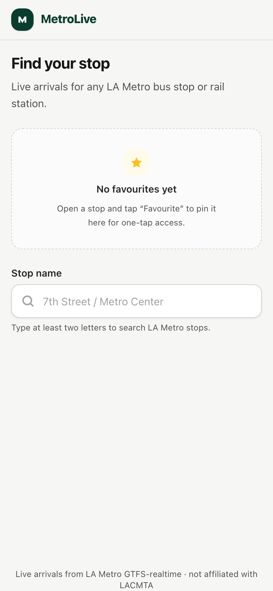
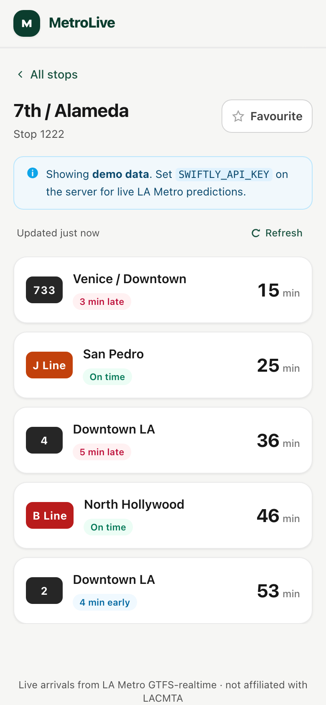

# MetroLive — LA Transit Tracker

Mobile-first web app for live LA Metro arrival predictions. Search any bus stop
or rail station, see when the next vehicles arrive and whether they're running
early / on time / late, and favourite the stops you use most.

**Live demo:** _<!-- add Vercel URL after deploy: https://metrolive.vercel.app -->_




<!-- Replace the images above with fresh screenshots after deploying. -->

---

## Architecture

The client is a Vite + React 18 + TypeScript single-page app (React Router,
TanStack Query for all server data, Zustand for the favourites list) styled with
Tailwind and built mobile-first from 375 px up. A pair of Vercel serverless
functions act as a backend-for-frontend: `/api/arrivals` fetches LA Metro's
GTFS-realtime TripUpdates protobuf feed (via Swiftly), decodes and reshapes it
with pure functions in `src/lib/transit.ts`, and returns a typed
`{ routeId, headsign, predictedTime, delaySeconds, status, … }[]`; `/api/stops`
serves name search and id lookup over a bundled snapshot of LA Metro's GTFS
*static* `stops.txt`. Every decode / filter / shape / search rule lives in
`src/lib/*` as React-free pure functions with unit tests, so the handlers only
do I/O and the same logic runs on both sides of the wire.

### Layout

| Path | Contents |
| --- | --- |
| `src/components` | Presentational components |
| `src/routes` | Page-level route components (`SearchRoute`, `StopRoute`, …) |
| `src/hooks` | React Query + small UI hooks |
| `src/lib` | Pure functions — feed decode/filter/shape, stop search, formatting, demo generator |
| `src/store` | Zustand store (`favorites.ts`, persisted to `localStorage`) |
| `src/types` | Types shared by the client **and** the serverless API |
| `api` | Vercel serverless functions (`arrivals.ts`, `stops.ts`); `_*` files aren't routes |
| `e2e` | Playwright specs |

## Data sources

| What | Source | Needs a key? |
| --- | --- | --- |
| Live arrivals | LA Metro **GTFS-realtime** TripUpdates (Swiftly), decoded with `gtfs-realtime-bindings` | **Yes** — [request one](https://developer.metro.net/api/) |
| Stop names / search | Bundled snapshot of LA Metro **GTFS static** `stops.txt` (`api/_data/stops.json`, ~12 k stops, server-only) | No |

Without a Swiftly key, `/api/arrivals` returns deterministic **demo** arrivals
(`X-Data-Source: demo`) so the whole app is explorable. Add the key locally:

```bash
cp .env.example .env.local     # then set SWIFTLY_API_KEY=...
```

## Getting started

```bash
npm install
npm run dev        # http://localhost:5173  — Vite + /api/* served by a dev plugin
```

| Script | Does |
| --- | --- |
| `npm run dev` | Dev server (client + `/api/*`) |
| `npm run build` | Typecheck + production build to `dist/` |
| `npm run serve` | Production-like server: built `dist/` + `/api/*` (used by e2e & Lighthouse) |
| `npm test` | Vitest — 78 unit + component tests |
| `npm run test:e2e` | Playwright — search → arrivals → favourite → reload flow (`npx playwright install` first) |
| `npm run lint` | ESLint (strict, no `any`) |
| `npm run lighthouse -- <url> <label>` | Lighthouse run against a served build |

## API

### `GET /api/arrivals?stopId=<id>`

`200` → `Arrival[]`, ascending by arrival time. Headers: `X-Data-Source: live|demo`,
`X-Feed-Timestamp`, `Cache-Control: public, s-maxage=20`.

```jsonc
[
  {
    "routeId": "801",
    "routeName": "A Line",
    "headsign": "APU / Citrus College",
    "scheduledTime": "2026-01-15T18:01:00.000Z",
    "predictedTime": "2026-01-15T18:05:00.000Z",
    "delaySeconds": 240,
    "status": "late"          // 'early' | 'ontime' | 'late' | 'unknown'  (± 60 s window)
  }
]
```

Errors → `{ "error": { "code": "…", "message": "…" } }`: `MISSING_STOP_ID` 400,
`METHOD_NOT_ALLOWED` 405, `NOT_CONFIGURED` 500 (only when `ARRIVALS_DEMO=0`),
`UPSTREAM_ERROR` / `DECODE_FAILED` 502, `UPSTREAM_UNAVAILABLE` 504.

### `GET /api/stops?q=<text>` · `GET /api/stops?id=<stopId>`

`200` → `{ id, name, lat, lon }[]` (search: ≤ 25 matches, `q` ≥ 2 chars; `id`: 0–1).

## Performance — Lighthouse before / after

Mobile emulation, gzipped, served by `npm run serve`. "Before" = no code-splitting,
eager `/stop/:stopId` route, non-virtualized list. "After" = the three Phase-4
changes: **virtualized arrivals list** (`@tanstack/react-virtual`),
**lazy-loaded `/stop/:stopId`** route (`React.lazy` + `Suspense`), **memoized**
derived arrival sort, plus `react-vendor` / `query` split into cacheable chunks.

| Page | Metric | Before | After |
| --- | --- | ---: | ---: |
| `/` (search) | Performance | 100 | 100 |
| | Accessibility | 100 | 100 |
| | Best Practices / SEO | 100 / 100 | 100 / 100 |
| | FCP / LCP | 1.4 s / 1.5 s | 1.5 s / 1.5 s |
| | CLS | 0 | 0 |
| | Transfer | 88.9 KiB | 88.9 KiB |
| `/stop/:id` | Performance | 99 | 98 |
| | Accessibility | 100 | 100 |
| | **CLS** | **0.062** | **0** |
| | LCP | 1.8 s | 2.0 s |
| | Transfer (cold) | 90.0 KiB | 102.9 KiB |
| **JS bundle** | initial (raw / gzip) | 265.9 KiB / 85.5 KiB (1 chunk) | ~262 KiB / ~86 KiB (`/`); `StopRoute` 34 KiB deferred |

_(“After” = the current build, including the visual redesign; a11y and CLS held
at 100 / 0 through it.)_

**Reading the numbers honestly:** gzipped and image-free, the app was already
99–100 before optimizing, so the scores don't move much. The concrete win is
**CLS on the stop page → 0** — virtualized rows have a fixed 80 px height, so the
list stops reflowing as predictions stream in. Lazy-loading trades a slightly
heavier *cold* stop-page load (one extra chunk request) for a leaner `/` parse
budget and a `react-vendor` chunk that survives redeploys in the browser cache —
a win for the search-first journey and repeat visits rather than a first cold
hit. (Local Lighthouse runs vary ±2 pts / ±0.03 CLS; run `npm run serve` then
`npm run lighthouse -- <url> <label>` to reproduce — JSON lands in `lighthouse/`.)

## Accessibility

Lighthouse **Accessibility: 100** on both routes. `aria-live="polite"` on the
arrivals region so updates are announced; skip link; visible focus rings
throughout; semantic landmarks and headings; every control labelled;
`aria-pressed` on the favourite toggle; AA-contrast colours; `prefers-reduced-motion`
honoured.

## Deploy (Vercel)

`vercel.json` sets the Vite preset, SPA rewrites (excluding `/api/`), long-cache
headers for `/assets/*`, and `includeFiles` so `api/_data/stops.json` ships with
the `stops` function.

```bash
vercel                     # preview
vercel --prod              # production
```

Set `SWIFTLY_API_KEY` in the Vercel project's environment variables for live
data (otherwise it runs in demo mode).

## Out of scope

No auth, database, trip planning, route maps, dark mode, or i18n — two screens,
one live data source, favourites in `localStorage`.
